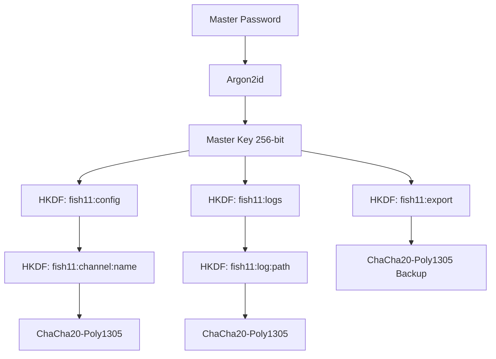

# Analyse exhaustive : Système de Master Key pour FiSH 11

## 🎯 Objectif

Protéger :
- la configuration (fichiers `.ini` contenant les clés des channels)
- les logs (fichiers sensibles)

Avec une Master Key unique (mot de passe maître) comme secret principal.

---

## 📊 État actuel (résumé)

D'après l'arborescence :
- clés parfois en clair dans `fish.ini`
- logs chiffrables mais key management insuffisant
- modules existants : `crypto`, `config`, `log`

---

## 🔐 Architecture proposée (avec bonnes pratiques clés/nonces)

### Schéma logique avec séparation stricte



### Principes fondamentaux appliqués

#### 1. **Séparation stricte des clés par contexte (HKDF)**

- **Une clé par usage**, jamais réutilisée dans un autre contexte
- **Schéma d'info clair** : préfixe global `"fish11:"` + type + identifiant
- **Pas de réutilisation** du même couple (IKM, info, longueur) pour deux usages

#### 2. **Unicité des nonces par clé (ChaCha20-Poly1305)**

- **Nonce = compteur** (recommandé) : 64-96 bits, encodage big-endian
- **Incrémentation** à chaque chiffrement, rejet si débordement
- **Persistance** du compteur pour survivre aux redémarrages
- **Anti-collision** : rejet si nonce déjà utilisé (probabilité négligeable)

#### 3. **Limites de volume et rotation de clés**

- **Limite par clé** : N messages ou quantité de données (ex: quelques Go)
- **Rotation automatique** : nouvelle génération via HKDF avec compteur
- **Format** : `k_channel_gen_i = HKDF(k_config, "fish11:channel:<chan>:gen:<i>")`
- **Stockage** : numéro de génération dans la config

---

## 🛡️ Algorithmes et paramètres recommandés

### Dérivation de clé : Argon2id (OWASP 2024)

```rust
const ARGON2_MEMORY_KB: u32 = 65536;  // 64 MB
const ARGON2_ITERATIONS: u32 = 3;
const ARGON2_PARALLELISM: u32 = 4;
const SALT_LENGTH: usize = 16;
const KEY_LENGTH: usize = 32;  // 256 bits
```

### Chiffrement authentifié : ChaCha20-Poly1305

```rust
// Structure d'un blob chiffré
struct EncryptedBlob {
    version: u8,              // Version du format (évolutivité)
    generation: u32,          // Numéro de génération de clé
    nonce_counter: u64,       // Compteur pour nonce (big-endian)
    ciphertext: Vec<u8>,      // Données chiffrées
    tag: [u8; 16],           // Tag Poly1305
}
```

### Dérivation de sous-clés : HKDF-SHA256

```rust
// Exemples d'utilisation
let config_kek = hkdf(master_key, b"fish11:config");
let channel_key = hkdf(config_kek, format!("fish11:channel:{}", channel_name));
let log_key = hkdf(log_kek, format!("fish11:log:{}", file_path));
```

---

## 📁 Format de stockage proposé

### Exemple `fish.ini` avec génération et compteurs

```ini
[FiSH]
encryption_version = 1
master_salt = BASE64(16 bytes)
password_verifier = BASE64(32 bytes)

[Keys]
; format : ENC:v1:gen:counter:nonce:ciphertext:tag
#channel1 = ENC:v1:0:42:BASE64_NONCE:BASE64_CT:BASE64_TAG

[KeyMetadata]
; Métadonnées pour rotation et compteurs
channel1_generation = 0
channel1_nonce_counter = 42

[Settings]
default_cipher = ChaCha20-Poly1305
max_messages_per_key = 10000
max_data_per_key_mb = 100
key_rotation_policy = auto
```

---

## 🔧 Modules à implémenter (Rust)

```
fish_11_core/src/master_key/
  - mod.rs              // API publique
  - derivation.rs       // Argon2id + HKDF avec séparation stricte
  - encryption.rs       // ChaCha20-Poly1305 avec gestion nonces/compteurs
  - keystore.rs         // lecture/écriture avec métadonnées génération/compteurs
  - memory.rs           // zeroize & gestion TTL + rotation
  - migration.rs        // migration depuis format clair
  - rotation.rs         // logique de rotation automatique des clés
```

### API publique proposée

```rust
// Gestion du cycle de vie
pub fn master_key_init(password: &str) -> Result<MasterKeyHandle, Error>;
pub fn master_key_unlock(password: &str) -> Result<MasterKeyHandle, Error>;
pub fn master_key_lock() -> Result<(), Error>;
pub fn master_key_change_password(old: &str, new: &str) -> Result<(), Error>;

// Opérations sur les clés de channel
pub fn get_channel_key(channel: &str) -> Result<ChannelKey, Error>;
pub fn set_channel_key(channel: &str, key: &ChannelKey) -> Result<(), Error>;

// Rotation et maintenance
pub fn rotate_channel_key(channel: &str) -> Result<(), Error>;
pub fn should_rotate_key(channel: &str) -> bool;

// Statistiques et monitoring
pub fn get_key_usage_stats(channel: &str) -> KeyUsageStats;
```

### Gestion des nonces et compteurs

```rust
struct NonceManager {
    counters: HashMap<String, u64>,  // clé -> compteur actuel
    used_nonces: HashMap<String, HashSet<u64>>,  // anti-collision
}

impl NonceManager {
    pub fn get_next_nonce(&mut self, key_id: &str) -> Result<[u8; 12], Error> {
        let counter = self.counters.entry(key_id.to_string()).or_insert(0);
        *counter += 1;
        
        // Vérifier anti-collision
        if self.used_nonces.entry(key_id.to_string()).or_default().contains(counter) {
            return Err(Error::NonceCollision);
        }
        
        // Encoder en big-endian (96 bits pour ChaCha20)
        let mut nonce = [0u8; 12];
        nonce[4..].copy_from_slice(&counter.to_be_bytes());
        
        Ok(nonce)
    }
}
```

---

## ⚠️ Sécurité opérationnelle avancée

### Protection contre les attaques

#### Rate-limiting des tentatives

```rust
struct UnlockAttempts {
    count: u32,
    last_attempt: Instant,
    lockout_until: Option<Instant>,
}

const MAX_ATTEMPTS: u32 = 5;
const LOCKOUT_DURATION: Duration = Duration::from_secs(300); // 5 min
```

#### Validation de la force du mot de passe

```rust
pub fn password_strength(password: &str) -> PasswordStrength {
    // zxcvbn scoring + règles personnalisées
    // - Longueur minimale 12 caractères
    // - Pas dans listes communes
    // - Entropie suffisante
}
```

### Gestion des volumes et rotation

#### Politiques de rotation

- **Par message** : maximum 10,000 messages par clé
- **Par volume** : maximum 100 MB de données chiffrées
- **Par temps** : rotation mensuelle automatique
- **Déclencheur manuel** : commande `/fish key rotate <channel>`

#### Stockage des métadonnées

```rust
#[derive(Serialize, Deserialize)]
struct KeyMetadata {
    generation: u32,
    created_at: DateTime<Utc>,
    message_count: u64,
    data_size_bytes: u64,
    last_used: DateTime<Utc>,
}
```

---

## 🔄 Migration et compatibilité

### Migration depuis format actuel

```rust
pub fn migrate_to_encrypted_format(
    password: &str,
    fish_ini_path: &Path
) -> Result<MigrationReport, MigrationError> {
    // 1. Backup fish.ini → fish.ini.backup
    // 2. Lire clés en clair
    // 3. Générer salt + dériver Master Key
    // 4. Créer génération 0 pour toutes les clés
    // 5. Chiffrer avec compteurs à 0
    // 6. Écrire nouveau format
    // 7. Retourner rapport détaillé
}
```

### Compatibilité descendante

- Détection automatique du format (clair vs chiffré)
- Fallback vers ancien format si Master Key non configurée
- Migration progressive (clé par clé)

---

## 📦 Dépendances Cargo

```toml
[dependencies]
# Dérivation et KDF
argon2 = "0.5"
hkdf = "0.12"
sha2 = "0.10"

# Chiffrement authentifié
chacha20poly1305 = "0.10"

# Protection mémoire
zeroize = { version = "1.7", features = ["derive"] }
secrecy = "0.8"

# Utilitaires
base64 = "0.21"
serde = { version = "1.0", features = ["derive"] }
chrono = { version = "0.4", features = ["serde"] }

# Optionnel : validation mots de passe
zxcvbn = "2.2"
```

---

## 🧪 Tests et validation

### Tests unitaires

- Dérivation de clés (Argon2id + HKDF)
- Chiffrement/déchiffrement ChaCha20-Poly1305
- Gestion des nonces et compteurs
- Rotation de clés
- Anti-collision des nonces

### Tests d'intégration

- Migration complète depuis format clair
- Cycle lock/unlock complet
- Rotation automatique
- Gestion des erreurs (mauvais mot de passe, corruption)

### Tests de sécurité

- Timing attacks (comparaison mots de passe)
- Memory leaks (valgrind/ASan)
- Fuzzing des parsers de blobs chiffrés

---

## 📋 Plan d'implémentation (phases)

### Phase 1 — Core cryptographique (2-3 jours)

- [ ] `derivation.rs` : Argon2id + HKDF avec séparation stricte
- [ ] `encryption.rs` : ChaCha20-Poly1305 + gestion nonces/compteurs
- [ ] Tests unitaires complets

### Phase 2 — Key management (2-3 jours)

- [ ] `keystore.rs` : lecture/écriture avec métadonnées
- [ ] `rotation.rs` : logique de rotation automatique
- [ ] `migration.rs` : migration depuis format clair

### Phase 3 — Interface DLL (1-2 jours)

- [ ] Fonctions `FiSH11_MasterKey*` pour mIRC
- [ ] Intégration avec commandes existantes
- [ ] Documentation utilisateur

### Phase 4 — Logs et finalisation (1 jour)

- [ ] Chiffrement automatique des logs
- [ ] Export/import backup
- [ ] Tests d'intégration complets

---

## 🎯 Résumé des bonnes pratiques appliquées

| Aspect | Pratique appliquée |
| -------- | ------------------- |
| Séparation clés | HKDF avec info unique par contexte |
| Unicité nonces | Compteur 64-bit + anti-collision |
| Limites volume | Rotation automatique (messages/volume/temps) |
| Protection mémoire | zeroize + secrecy + TTL |
| Évolutivité | Version headers + migrations |
| Robustesse | Rate-limiting + validation mots de passe |

Cette architecture apporte une **sécurité en profondeur** réelle, bien supérieure à de simples couches multiples d'algorithmes. La séparation stricte des clés et l'unicité des nonces sont les piliers fondamentaux.

---

*Analyse basée sur les meilleures pratiques cryptographiques actuelles (OWASP, NIST) et optimisée pour un client IRC comme FiSH 11.*</content>


