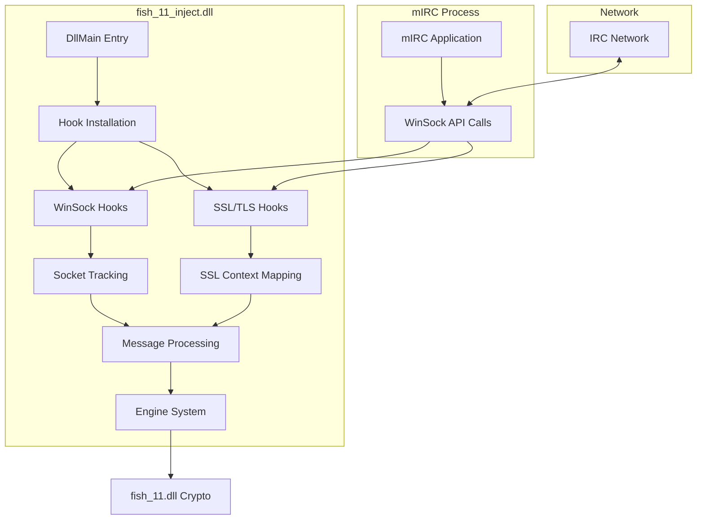
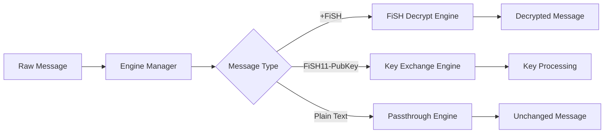
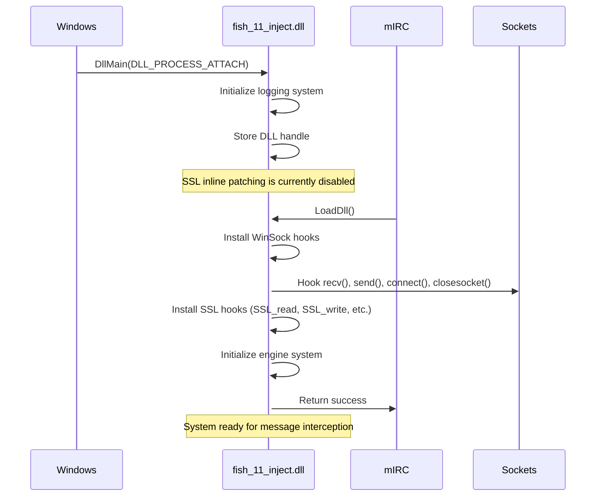
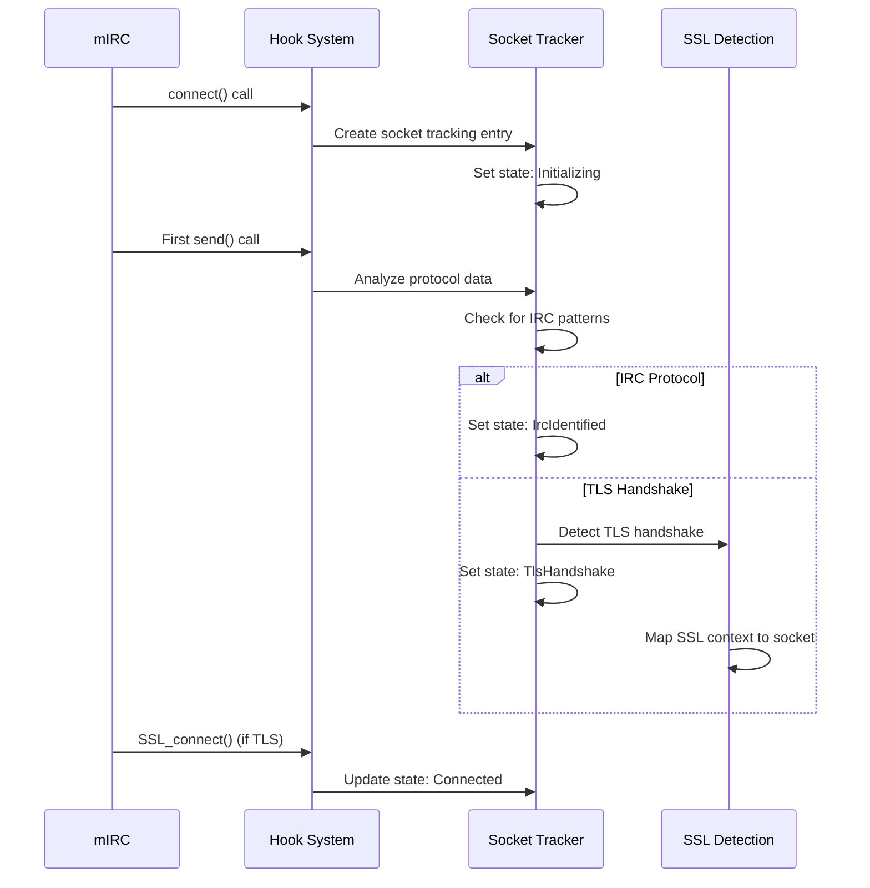
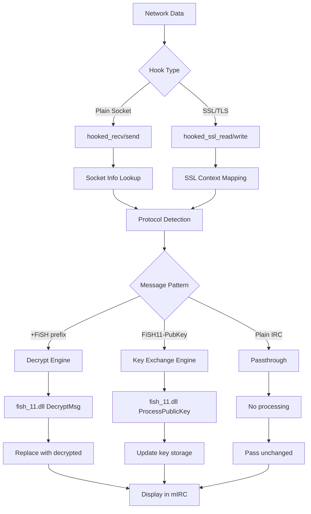

# FiSH_11 injection DLL howto

## Overview

The `fish_11_inject.dll` is the core Windows injection component of FiSH_11 that provides transparent IRC encryption through WinSock and SSL/TLS function hooking.

This DLL **must** be loaded before the main crypto DLL to establish proper message interception.

## Architecture



## Core Components

### 1. Hook System (`hook_socket.rs`, `hook_ssl.rs`)

**WinSock Function Hooks:**

- `recv()` - Intercepts incoming IRC messages
- `send()` - Processes outgoing messages for encryption
- `connect()` - Tracks new socket connections
- `closesocket()` - Cleans up socket state and SSL mappings

**SSL/TLS Function Hooks:**

- `SSL_read()` - Intercepts decrypted TLS data
- `SSL_write()` - Processes plaintext before TLS encryption
- `SSL_set_fd()` - Maps SSL contexts to socket descriptors
- `SSL_connect()` - Detects TLS handshake completion

### 2. Socket State Management (`socket_info.rs`)

Tracks comprehensive socket information:

```rust
pub struct SocketInfo {
    socket_id: u32,
    is_ssl: AtomicBool,
    state: AtomicU8,          // Connection state
    stats: Mutex<SocketStats>, // Traffic statistics
    received_buffer: Mutex<Vec<u8>>,
    processed_buffer: Mutex<Vec<u8>>,
    engines: Arc<InjectEngines>,
}
```

**Socket States:**

- `Initializing` - New socket, protocol unknown
- `IrcIdentified` - Recognized as IRC connection
- `TlsHandshake` - TLS handshake in progress
- `Connected` - Fully established connection
- `Closed` - Socket closed and cleaned up

### 3. SSL Detection & Context Mapping (`ssl_detection.rs`)

Automatically detects OpenSSL libraries in the mIRC process:

```rust
pub struct OpenSslInfo {
    module_handle: HMODULE,
    dll_name: String,         // e.g., "libssl-3.dll"
    version: String,          // OpenSSL version
    ssl_read_addr: *const u8,
    ssl_write_addr: *const u8,
}
```

**Supported OpenSSL Versions:**

- OpenSSL 3.x (`libssl-3.dll`, `libssl-3-x64.dll`)
- OpenSSL 1.1.x (`libssl-1_1.dll`, `libssl-1_1-x64.dll`)
- Legacy versions (`ssleay32.dll`, `libeay32.dll`)

### 4. Engine System (`engines.rs`)

Extensible message processing pipeline:



### 5. Inline Patching (`ssl_inline_patch.rs`)

**Note: This feature is currently disabled in the code (`DllMain`) but the underlying implementation exists.**

Advanced SSL function patching for enhanced interception:

- Binary-level function patching
- Memory protection management
- Thread-safe patch installation/removal
- Version-specific OpenSSL support

## Message Flow Diagrams

### 1. DLL Initialization Sequence



### 2. Socket Connection & SSL Detection



### 3. Message Interception & Processing



## API Reference

### DLL Interface Functions

**`LoadDll(loadinfo: *mut LOADINFO) -> c_int`**

- Main entry point called by mIRC after DllMain
- Installs all hooks and initializes systems
- Returns success/failure status

**`UnloadDll(timeout: c_int) -> c_int`**

- Cleanup and unload handler
- Removes all hooks safely
- Cleanup socket tracking

**`FiSH11_InjectVersion() -> c_int`**

- Returns injection DLL version information
- Displays build date and time
- Used for diagnostics

**`FiSH11_InjectDebugInfo() -> c_int`**

- Comprehensive debugging information
- Socket statistics and engine status
- Active connections and SSL mappings

### Hook Installation Functions

```rust
// Install all WinSock hooks
pub fn install_hooks() -> Result<(), io::Error>

// Install SSL-specific hooks  
pub unsafe fn install_ssl_hooks(
    ssl_read: SslReadFn,
    ssl_write: SslWriteFn, 
    ssl_get_fd: SslGetFdFn,
    ssl_is_init_finished: SslIsInitFinishedProc
) -> Result<(), String>

// Install binary patches for SSL functions
pub unsafe fn install_ssl_inline_patches() -> Result<(), String>
```

### Socket Management API

```rust
// Create or retrieve socket information
pub fn get_or_create_socket(socket_id: u32, is_ssl: bool) -> Arc<SocketInfo>

// Socket state management
impl SocketInfo {
    pub fn set_state(&self, state: SocketState)
    pub fn get_state(&self) -> SocketState
    pub fn set_ssl(&self, is_ssl: bool)
    pub fn is_ssl(&self) -> bool
    pub fn get_stats(&self) -> String
}
```

## Configuration & Debugging

### Build Configurations

**Debug Build:**

- Comprehensive logging to `fish11_inject.log`
- Detailed hook tracing
- SSL handshake monitoring
- Message content logging (first 32 bytes)

**Release Build:**

- Minimal logging
- Performance optimized
- Production-ready

### Log Output Examples

```bash
[INFO] FiSH_11 inject v11 (build date: 2025-01-01, build time: 12:00:00)
[INFO] Installing Winsock hooks:
[INFO] Found SSL_read (SSL_read) in libssl-3.dll
[INFO] Found SSL_write (SSL_write) in libssl-3.dll
[INFO] All SSL hooks successfully installed!
[DEBUG] Socket 1234: identified as IRC connection
[DEBUG] Socket 1234: TLS handshake completed successfully
[TRACE] Socket 1234: [RECV HOOK] UTF-8: PRIVMSG #channel :+FiSHEncryptedMessage
```

### Troubleshooting

| Issue | Symptoms | Solution |
|-------|----------|----------|
| **No SSL Detection** | SSL networks don't work | Check if OpenSSL DLL is loaded |
| **Hook Installation Fails** | mIRC crashes on load | Verify DLL loading order |
| **Messages Not Intercepted** | Encryption not working | Check `fish11_inject.log` for hook status |
| **SSL Context Mapping** | TLS decryption fails | Verify SSL_set_fd hook is active |

### Debug Commands

```mirc
; Check injection DLL status
/dll fish_11_inject.dll FiSH11_InjectVersion

; Get detailed debug information  
/dll fish_11_inject.dll FiSH11_InjectDebugInfo

; Check if injection DLL is loaded
/dll -u fish_11_inject.dll
```

## Technical Implementation Details

### Memory Safety

- **Thread-safe operations** using `Mutex` and `Arc`
- **Poison handling** for mutex corruption
- **Automatic cleanup** on DLL unload
- **Bounds checking** for all buffer operations

### Performance Optimizations

- **Lazy initialization** of hook systems
- **Efficient pattern matching** for message types
- **Minimal overhead** on non-encrypted messages
- **Socket state caching** to avoid repeated lookups

### Security Features

- **Input validation** on all hook parameters
- **Safe buffer handling** with bounds checking  
- **Secure SSL context mapping** with proper cleanup
- **Error isolation** preventing crashes

### Compatibility

- **32-bit mIRC support** (i686-pc-windows-msvc target)
- **Multiple OpenSSL versions** (1.0.x, 1.1.x, 3.x)
- **Windows Vista/7/8/10/11** compatibility
- **Various IRC networks** (plain and SSL/TLS)

## Development

### Building

```powershell
# From project root
cd fish_11_inject

# Debug build with full logging
cargo build --target i686-pc-windows-msvc

# Release build for production
cargo build --release --target i686-pc-windows-msvc
```

### Testing

```powershell
# Test DLL loading
fish_11_cli.exe fish_11_inject.dll FiSH11_InjectVersion

# Load in mIRC for testing
/load -rs fish_11.mrc
```

### Code Structure

```
fish_11_inject/
├── src/
│   ├── lib.rs                 # Main entry point and DllMain
│   ├── dll_interface.rs       # mIRC DLL interface functions
│   ├── hook_socket.rs         # WinSock function hooks
│   ├── hook_ssl.rs           # SSL/TLS function hooks
│   ├── socket_info.rs        # Socket state management
│   ├── ssl_detection.rs      # OpenSSL library detection
│   ├── ssl_inline_patch.rs   # Binary patching system
│   ├── engines.rs            # Message processing engines
│   └── helpers_inject.rs     # Utility functions
├── Cargo.toml               # Rust package configuration
└── build.rs                # Build script for Windows resources
```

## License

GNU General Public License v3.0

## Contributing

This component requires deep Windows system programming knowledge:

- **Win32 API expertise** for socket hooking
- **OpenSSL internals** for SSL/TLS interception
- **Assembly/binary patching** for inline patches
- **Thread safety** and concurrency handling
- **Windows DLL development** experience

Contact: `guillaume@lavache.com` for development questions.
